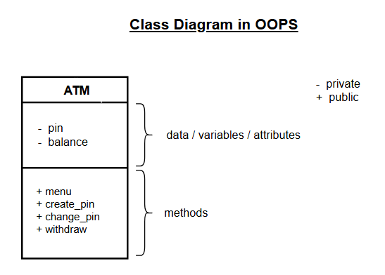
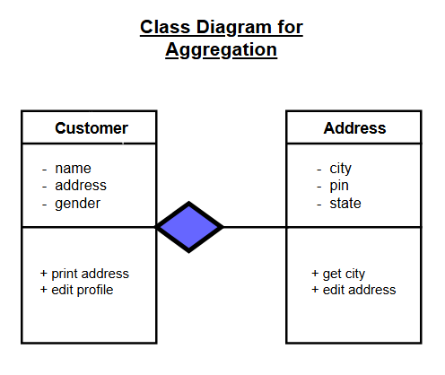
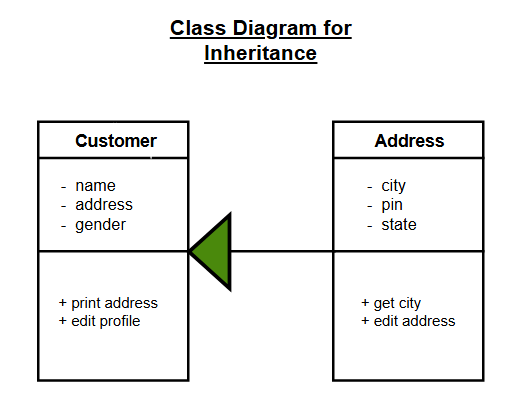

# **Object-Oriented Programming (OOP) Concepts in Python**

This repository contains my practice implementations and notes on important OOP concepts in Python.

**e.g.** L = [1, 2, 3]
L.upper()

-> It will give error because 'list' object has no attribute 'upper'.

**e.g.** s = "hello"
s.append('x)

-> It will give error because 'str' object has no attribute 'append'.

**Note**: `Everything in Python is an object.`

The main advantage of writing OOPS code is if programmers wants to create their own datatype, then they can easily create it according to their customized application.

Python has 2 types of classes:-

- Built in
- User defined

`Class` is a blueprint which contains set of rules that how it's object will behave. Mainly, class has two things to focus upon:-

- Data or properties
- Functions or behavior

#### **Important distinction between function and methods**

If some function exist inside the class, then we will call it as a method. And if some function exists independently outside the class, then we will call it as a function. 

#### **Constructor**

Constructor is an object that we don't have to call explicitly. It will automatically get called when the object of that class has been created.

**Class Diagram**

This diagram outlines the fundamental components of an object-oriented model.



#### **Magic Methods**

These are special methods in python that start and end with double underscores. e.g. __init__, __str__, etc. Python automatically calls magic methods for us.

**[Interview Question] - What is the benefit of Constructor?**

Main benefit of constructor is, it includes configuration related code whose control programmer don't want to give to the user. 

For example, in a Bank Account system, we should not allow users to directly set the balance arbitrarily during object creation. The constructor can validate or restrict such initialization to prevent inconsistency.

#### **Concept of self**

self is an object only through which we can access data members and methods of the class.

But the main use of self comes into picture, is when two methods of the class has to talk to each other.

#### **Types of variables in object oriented programming**

##### **1. Reference Variable**

A reference variable stores the address (reference) of an object, not the actual object itself.

```python
class Student:
    def __init__(self, name):
        self.name = name
    
s1 = Student("Ajay")     # s1 is a reference variable
```

Here:
- `s1` stores the reference to that object.
- `s1` is a reference variable.

##### **2. Instance Variable**

An instance variable is a variable that belongs to an object. Each object has its own separate copy of instance variables.

```python
class Student:
    def __init__(self, name):
        self.name = name          # instance variable
    
s1 = Student("Rahul")
s2 = Student("Ajay")
```

Here:
- `name` is an instance variable.
- `s1.name` and `s2.name` are different.
- Each object stores its own data.

##### **3. Static Variable (Class Variable)**

A static variable (also called class variable) belongs to the class, not to individual objects.

It is shared among all objects of that class.

It is defined outside the constructor but inside the class.

```python
class Student:
    school_name = "ABC School"   # static (class) variable

    def __init__(self, name):
        self.name = name     # instance variable

s1 = Student("Rahul")
s2 = Student("Ajay")
```

Here:
- `school_name` is shared by all students.
- Changing it affects all objects.

### **<u>Encapsulation</u>**

Encapsulation is the concept of binding data (variables) and methods (functions) together inside a class and restricting direct access to some of the object’s components.

It is used to protect the internal state of an object and ensure controlled access to it.

**Real-World Examples**

In a banking system:

- Users should not directly modify account balance.
- Balance should only change via deposit or withdrawal methods.
- This prevents inconsistent or invalid states.

**Structural Example**

```python
class BankAccount:
    def __init__(self, balance):
        self.__balance = balance  # private variable

    def deposit(self, amount):
        if amount > 0:
            self.__balance += amount

    def get_balance(self):
        return self.__balance


account = BankAccount(1000)

account.deposit(500)
print(account.get_balance())  # 1500
```

### **<u>Aggregation</u>**

Aggregation is a relationship between two classes where one class uses or contains an object of another class, but both can exist independently.

**Note**: `The container class should not access private members of the other class directly (it should use public methods).`

**Real-Life Examples**

- A Department has Teachers.
- If the Department is deleted, Teachers can still exist.

So:

- Department -> has a -> Teacher
- But Teacher does not depend on Department to exist.

**Structural Example**

```python
class Teacher:
    def __init__(self, name):
        self.name = name
    
class Department:
    def __init__(self, teacher):
        self.teacher = teacher

t1 = Teacher("Vijay")
dept = Department(t1)

print(dept.teacher.name)

```

**Class Diagram**

The diagram below demonstrates aggregation using another example (`Customer` and `Address`) for clarity.



#### **Explanation**

- `Customer` has an `Address` (has-a relationship).
- The hollow diamond represents aggregation.
- Both classes can exist independently.


### **<u>Inheritance</u>**

Inheritance is an OOP concept where one class acquired the properties and methods of another class. It represents an is-a relationship.

**Key idea of inheritance**

- It promotes code reusability.
- Helps in building relationships.
- Child class can reuse and extend parent class functionality.

**Basic Example**

```python
class Animal:
    def speak(self):
        print("Animal makes a sound")
    
class Dog(Animal):
    def bark(self):
        print("Dog barks")

d = Dog()
d.speak()
d.bark()
```
**Class Diagram**

The diagram below demonstrates inheritance for visual clarity.



**Types of Inheritance**

1. `Single Inheritance:` One child class inherits from one parent class.
2. `Multiple Inheritance:` One child class inherits from more than one parent class.
3. `Multiple Inheritance:` A class inherits from a class that is already a child class.
4. `Hierarchical Inheritance:` Multiple child classes inherit from one parent class.


**Note**: `When a same method is present in both parent class and child class, then always child class method will be called.`


#### **<u>Super keyword</u>**

- Using `super keyword`, we can call the parent class constructor even if there is already child class constructor defined.
- super is called always inside the child class constructor.
- super can't access the variables, it can only access the methods.


### **<u>Abstraction</u>**

Abstraction is the concept of hiding implementation details and showing only essential features of an object.

Basically, it focuses on what an object does, not how it does it.

In Python, abstraction is commonly implemented using:

- Abstract class
- The `abc` module
- Abstract methods

**Example using Abstract Base Class**

```python
from abc import ABC, abstractmethod

class Vehicle(ABC):

    @abstractmethod
    def start_engine(self):
        pass

class Car(Vehicle):

    def start_engine(self):
        return "Car engine started"

c = Car()
print(c.start_engine())
```

**Explanation**

- `Vehicle` is an abstract class (inherits from `ABC`).
- `start_engine()` is an abstract method.
- Any class inheriting from `Vehicle` must implement `start_engine()`.
- We cannot create an object of `Vehicle` directly.

### **Polymorphism**

Polymorphism means "many forms."

In Object-Oriented Programming, polymorphism allows the same method name to behave differently depending on the object that calls it.

#### **Types of Polymorphism**

##### **1. Compile-Type Polymorphism (Method Overloading)**

Method overloading means having multiple methods with the same name but different parameters.

**Note**: `Python does not support traditional method overloading like Java or C++, but it can be achieved using default arguments.`

```python
class Calculator:
    def add(self, a, b, c=0):
        return a + b + c

calc = Calculator()
print(calc.add(2, 3))      # 5
print(calc.add(2, 3, 4))   # 9
```

##### **2. Run-Type Polymorphism (Method Overriding)**

Method overriding happens when a child class provides a specific implementation of a method that is already defined in its parent class.

```python
class Animal:
    def sound(self):
        print("Animal makes a sound")

class Dog(Animal):
    def sound(self):
        print("Dog barks")

class Cat(Animal):
    def sound(self):
        print("Cat meows")


animals = [Dog(), Cat()]
```

**Real-World Example**

In a payment system:

- `pay` method exists.
- CreditCard, UPI, and NetBanking implement it differently.

The system calls pay() without worrying about which payment method is used.